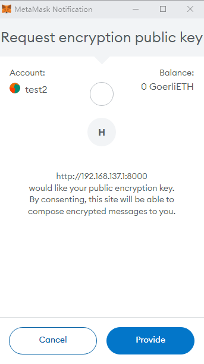
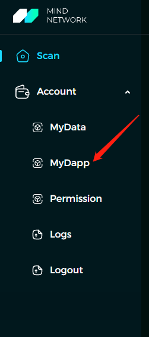

  
  <h1>MindLake Tutorial: Configure Wallet</h1>
  
  

    A step-by-step cookbook for Wallet Configuration to access Mind Lake !
  

<!-- toc generator: 1. install "markdown all in one" in vs code, 2. cmd: create table of contents -->
<!-- Table of Contents -->
## :notebook_with_decorative_cover: Table of Contents
- [:notebook\_with\_decorative\_cover: Table of Contents](#notebook_with_decorative_cover-table-of-contents)
- [:star2: 0. Step by step tutorial](#star2-0-step-by-step-tutorial)
- [:star2: 4. Prepare env.py](#star2-4-prepare-envpy)
  - [:art: 4.1. Prepare Wallet](#art-41-prepare-wallet)
    - [:dart: 4.1.1 Install Wallet](#dart-411-install-wallet)
    - [:dart: 4.1.2 Wallet Sign In: https://scan.mindnetwork.xyz](#dart-412-wallet-sign-in-httpsscanmindnetworkxyz)
    - [:dart: 4.1.3 Copy the wallet address from MetaMask to env.py](#dart-413-copy-the-wallet-address-from-metamask-to-envpy)
    - [:dart: 4.1.4 Export private key from MetaMask to env.py](#dart-414-export-private-key-from-metamask-to-envpy)
  - [:art: 4.2. Prepare appKey](#art-42-prepare-appkey)
      - [:dart: 4.2.1 create Dapp](#dart-421-create-dapp)

## :star2: 0. Step by step tutorial
This is part of support chapter for MindLake step-by-step tutorial for [Python](README.md)

## :star2: 4. Prepare env.py
`env.py` contains the settings of parameters used in examples and use cases, you can copy `env_template.py` to the name `env.py` and modify it as per your requirement. 
If you want to run the examples of QuickStart, Use Case 1 and Use Case 2, you only need to fill out `walletAddressAlice`, `walletPrivateKeyAlice` and `appKey`. 
If you want to run Use Case 3, you need to fill out the walltes info for all of `Alice`, `Bob` and `Charlie`.

### :art: 4.1. Prepare Wallet

#### :dart: 4.1.1 Install Wallet
1. Install [MetaMask](https://metamask.io/download/) plugins in Chrome Browser
2. [Sign up a MetaMask Wallet](https://myterablock.medium.com/how-to-create-or-import-a-metamask-wallet-a551fc2f5a6b)
3. Change the network to Goerli TestNet. If the TestNets aren't displayed, turn on "Show test networks" in Settings.

4. Goerli Faucet for later gas fee if does not have: [Alchemy Goerli Faucet](https://goerlifaucet.com/), [Quicknode Goerli Faucet](https://faucet.quicknode.com/ethereum/goerli), [Moralis Goerli Faucet](https://moralis.io/faucets/)
__Note__ that you need to get test coin from faucets for ALL of the wallets specified in env.py

  
  
#### :dart: 4.1.2 Wallet Sign In: https://scan.mindnetwork.xyz
1. Open a browser and visit [mind-scan](https://scan.mindnetwork.xyz/scan)
2. Click "Sign in" buttom

  
  
2.1 During the 'Connect' procedure, the wallet will prompt the user 2-3 times as follows:
   Sign a nonce for login authentication.
  
  
  
2.2 If the user's account keys are already on the chain: Decrypt the user's account keys using the wallet's private key.
  
  

2.3 If the user's account keys do not exist yet: Obtain the public key of the wallet, which is used to encrypt the randomly generated account keys.
  
  

2.4 Sign the transaction to upload the encrypted key ciphers to the smart contract on the chain.
  
  

#### :dart: 4.1.3 Copy the wallet address from MetaMask to env.py
Click the copy icon beside the wallet address in UI of MetaMask, and paste into env.py
#### :dart: 4.1.4 Export private key from MetaMask to env.py
These are the steps outlined in the [MetaMask support documentation](https://support.metamask.io/hc/en-us/articles/360015289632-How-to-export-an-account-s-private-key).
1. Click on the identicon in the top right.
2. Select the account you'd like to export.
3. On the account page, click on the menu (three dots) in the upper right corner, and then on the "Account Details" button.
4. Click “Export Private Key”.
5. To access your private key, you'll now need to enter your wallet password. Once you've done so, click “Confirm” to proceed.
6. Your private key will now be revealed. Click to copy it, and paste into env.py.
7. Click “Done” to close the screen.

### :art: 4.2. Prepare appKey

##### :dart: 4.2.1 create Dapp
1. Click `myDapp` in left side manu

2. Click "Create Dapp" 

3. Input your Dapp name and then click "Create"

4. copy appKey value into env.py to update "appKey"

