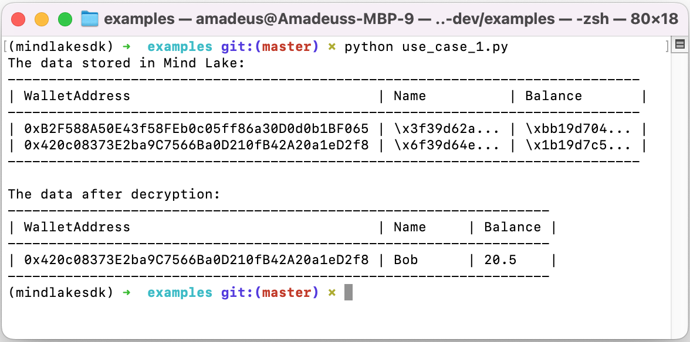

<div align="center">

  
  <h1>MindLake Tutorial: Python SDK</h1>
  
  <p>
    A step-by-step cookbook for beginner to access Mind Lake !
  </p>
</div>

<!-- toc generator: 1. install "markdown all in one" in vs code, 2. cmd: create table of contents -->
<!-- Table of Contents -->
## :notebook_with_decorative_cover: Table of Contents
- [:notebook\_with\_decorative\_cover: Table of Contents](#notebook_with_decorative_cover-table-of-contents)
- [:star2: 0. Other Programming Languages](#star2-0-other-programming-languages)
- [:star2: 1. Install Or Upgrade Python If Needed](#star2-1-install-or-upgrade-python-if-needed)
- [:star2: 2. Install MindLakeSDK](#star2-2-install-mindlakesdk)
- [:star2: 3. Get Examples](#star2-3-get-examples)
- [:star2: 4. Prepare env.py If Needed](#star2-4-prepare-envpy-if-needed)
- [:star2: 5. Execute the examples](#star2-5-execute-the-examples)
  - [:art: 5.1 QuickStart](#art-51-quickstart)
  - [:art: 5.2 Use Case 1: Single User with Structured Data](#art-52-use-case-1-single-user-with-structured-data)
  - [:art: 5.3 Use Case 2: Single User with Unstructured Data](#art-53-use-case-2-single-user-with-unstructured-data)
  - [:art: 5.4 Use Case 3: Multi Users with Permission Sharing](#art-54-use-case-3-multi-users-with-permission-sharing)


## :star2: 0. Other Programming Languages
- [TypeScript](https://github.com/mind-network/mind-lake-sdk-typescript/)

## :star2: 1. Install Or Upgrade Python If Needed
- Click to view [step-by-step to configure Python](Configure_Python.md) if Python is not installed or upgraded

## :star2: 2. Install MindLakeSDK
1. Open Terminal and Enter the install command:
```shell
pip install mindlakesdk
```
The required package will be automatically installed as a dependency, and get the following output in the end:
```
Installing collected packages: mindlakesdk
Successfully installed mindlakesdk-1.0.1
```

2. Validate the installation in Terminal
```
$ pip show mindlakesdk
Name: mindlakesdk
Version: 1.0.1
Summary: A Python SDK to connect to Mind Lake
Home-page:
Author:
Author-email: Mind Labs <biz@mindnetwork.xyz>
License:
Location: /Users/xxx/.pyenv/versions/3.10.11/lib/python3.10/site-packages
Requires: eth-account, pynacl, web3
Required-by:
```

3. You can also validate in idel
```
$ python3
Python 3.10.11 (main, May  1 2023, 01:38:51) [Clang 16.0.2 ] on darwin
Type "help", "copyright", "credits" or "license" for more information.
>>> import mindlakesdk
>>>
```


## :star2: 3. Get Examples
1. Enter the following command in the terminal window to fetch the example code from github:
```shell
git clone https://github.com/mind-network/mind-lake-sdk-python.git
```
2. Enter the path of example code:
```shell
cd mind-lake-sdk-python/examples
```


## :star2: 4. Prepare env.py If Needed
1. `env.py` contains the settings of parameters used in examples and use cases, you can copy `env_template.py` to the name `env.py` and modify it as per your requirement. 


2. `env.py` will need `walletAddress`, `walletPrivateKey` and `appKey`.

  - 2.1. Click [:art: 4.1. Prepare Wallet](Configure_Wallet.md#art-41-prepare-wallet) if test wallets (by MetaMask) are not created and `walletAddress` is not set in `env.py`.
  
  - 2.2. Click [:dart: 4.1.4 Export private key from MetaMask to env.py](Configure_Wallet.md#dart-414-export-private-key-from-metamask-to-envpy) if `walletPrivateKey` is not set in `env.py`
  
  - 2.3 Click [:dart: 4.1.3 Register wallets if not in whitelist during testing period](Configure_Wallet.md#dart-413-register-wallets-if-not-in-whitelist-during-testing-period) if `walletAddress` is not in whitelist during testing period.
  
  - 2.4 Click [:art: 4.2. Prepare appKey](Configure_Wallet.md#art-42-prepare-appkey) if `appKey` is not set.
  
3. If you want to run the examples of QuickStart, Use Case 1 and Use Case 2, you only need to fill out `walletAddressAlice`, `walletPrivateKeyAlice` and `appKey`. 
4. If you want to run Use Case 3, you need to fill out the walltes info for all of `Alice`, `Bob` and `Charlie`.


## :star2: 5. Execute the examples
You can execute the following commands to run the quickstart and use cases.
### :art: 5.1 QuickStart
```shell
python quickstart.py
```

### :art: 5.2 Use Case 1: Single User with Structured Data
```shell
python use_case_1.py
```

### :art: 5.3 Use Case 2: Single User with Unstructured Data
```shell
python use_case_2.py
```
You can also check the result by opening these two picture files.

<!--  -->
### :art: 5.4 Use Case 3: Multi Users with Permission Sharing
```shell
python use_case_3.py
```

